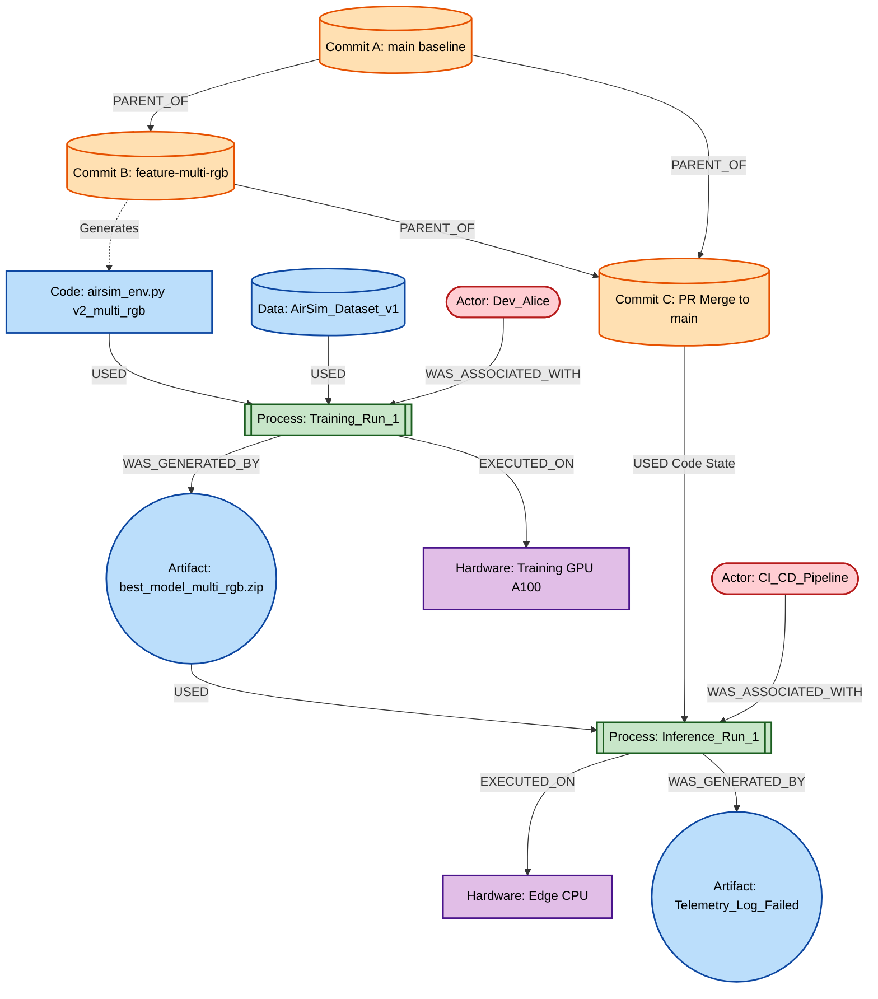
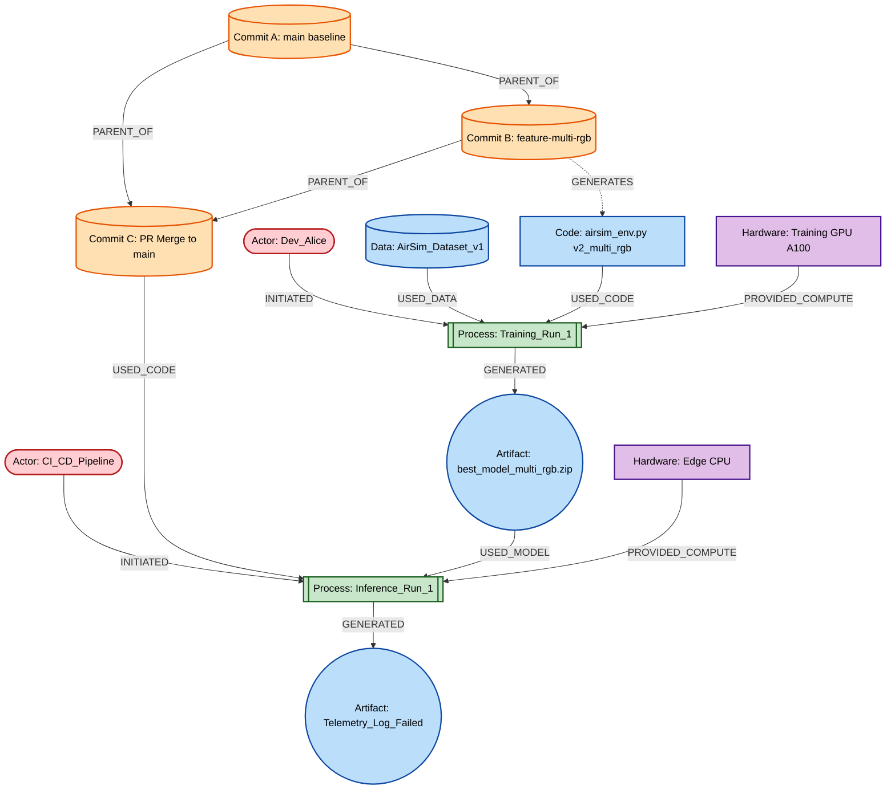

# AirSim RL Provenance Tracking System

Welcome to the AirSim RL Provenance Tracking project. This repository contains the code, models, and environments for training a drone to navigate complex geometries using Proximal Policy Optimization (PPO) in AirSim, alongside a robust provenance graph system for tracking hardware, code, and model dependencies.

## Architecture & Provenance Graph

The following Directed Acyclic Graph (DAG) illustrates the provenance tracking of our system. It tracks the exact lineage of code commits, training processes, and hardware execution environments to assist with root-cause analysis. For instance, you can use this to trace a simulated drone failure directly back to a specific code merge or hardware execution state.

# AirSim RL Provenance Tracking System

Welcome to the AirSim RL Provenance Tracking project. This repository contains the code, models, and environments for training a drone to navigate complex geometries using Proximal Policy Optimization (PPO) in AirSim. 

## Hindsight Provenance Graph Architecture

The following Directed Acyclic Graph (DAG) illustrates the hindsight tracking of our system. It maps the exact lineage of code commits, training data, and hardware execution environments to assist with rapid root-cause analysis. 

To optimize for backward traversal during anomaly detection, all dependencies (Actors, Code, Data, and Hardware) are modeled as directed inputs flowing into the execution processes. If a failure occurs at the terminal evaluation node, the detection system simply follows the incoming edges backward to isolate the exact vulnerability.

